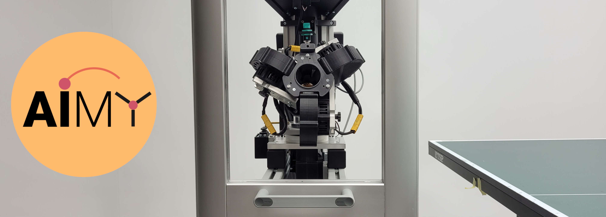

<p align="center">
  
</p>

# Low-level Ball Launcher Control 
Ball Launcher Beepy is a low-level control environment for remote table tennis ball launching. It features 
- hardware server functions for controlling of motors and servomotors via Python
- client APIs for remote launching via Python and C++ 

## Installation
Installation under Ubuntu 16.04 or Ubuntu 18.04

### Requirements
* libzmq (ZeroMQ)
* protobuf (Protocol buffers)

The server side additionally needs
* xinabox-OC03
* xinabox-OC05

```bash
sudo apt install libzmq3-dev
sudo apt install protobuf-compiler libprotobuf-dev

# for server side only (TODO: Does this need a sudo?)
pip3 install xinabox-OC05
pip3 install xinabox-OC03

# usually pre-installed with raspbian 
pip3 install RPi.GPIO
```

### Build using CMake
In build directory:

```bash
cmake path/to/repository
make install
```

This will generate the ball_launcher_pb2.py file in the ball_launcher subdirectory of the repository. In the repository directory:

```bash
pip install --editable .
```

### Configuration file

The off ticks of the PWM signals as well as sleep times can be adjusted in a JSON file at `~/.ball_launcher_config.json". Note: The comments were inserted for clarification but are not supported by JSON. Do not add them to the actual file.

```json
{
    # channels used in servo driver
    "channels": {
      "phi": 1, # azimuthal angle of launcher
      "theta": 2, # altitude of launcher
      "top_left_motor": 6, # motor of top left wheel
      "top_right_motor": 3, # motor of top right wheel
      "bottom_motor": 7, # motor of bottom wheel
      "ball_supply_push": 8, # pushes ball towards wheels
      "stirrer": 5, # stirs ball in funnel
      "stirr_sensor": 21 # stirr sensor, only add entry if equipped
    },
    # max and min values for "off" tick value of pulse
    "ticks":
    {
      "phi": [30, 150],
      "theta": [30, 150],
      "motor": [30, 150], 
      "top_left_motor_offset": [0, 0], # offset is added to min/max respectively
      "top_right_motor_offset": [0, 0],
      "bottom_motor_offset": [10, 10],
      "ball_supply_push": [30, 180],
      "stirrer": [102, 180]
    },
    "times": {
      # time to sleep after changing PWM signal in order to give system time
      # to reach a stationary configuration.
      "t_launch_delay": 1.0,
      # time until motors are stopped if automatic motor reset is enabled.
      "t_reset_motors": 0.5,
      # time in endposition until default position of crank mechanism is set.
      "t_supply_reset": 1.0,
      # time stirring if stirring after launch is enabled.
      "t_stirring": 4.0
    },
    "launching_parameters":
    {
      # specifier, if motors should be stopped after each launch.
      "automatic_motor_reset": true,
      # stroke increment for increasing position of crank mechanism
      "ball_supply_stroke_gain": 3.0,
      # specifier, if automatic stirring after launching should be enabled.
      "stirring_after_launch": true
    }
}
```

## Usage

### Usage via graphical user interface

After successful build of the ball launcher software with ```colcon build```, colcon provides executables. For running the ball launcher directly via graphical user interface on a screen, type ```ball_launcher_gui``` in a terminal.

> **Note**
> The setup.bash generated with colcon has to be sourced in your current terminal session, so the terminal knows the corresponding commands.

For providing the GUI for users without coding experience, we recommend pasting the following code into a shell script:

```bash
#!/bin/bash

source ~/.bashrc
source ~/PATH_TO_COLCON_FOLDER/install/setup.bash

ball_Launcher_gui
```

Set the script to executable in the properties menue of the shell script. 

### Start server
On Raspberry Pi built into ball launcher (in repository directory),

```bash
python tests/run_server.py port_number
```
where port\_number specifies the port number, e.g., 5555.

The server can also be started via the shell command ```ball_launcher_server```, if the colcon setup.bash file is properly sourced.

### Creating a client in Python and launching a ball
See tests/launch\_ball\_from\_client.py

```python
import sys

from ball_launcher_beepy import BallLauncherClient

ip_address = sys.argv[1]
port = int(sys.argv[2])
client = BallLauncherClient(ip_address, port)

client.set_state(
        phi = 0.5, 
        theta = 0.5, 
        top_left_actuation = 0.3,
        top_right_actuation = 0.3,
        bottom_center_actuation = 0.3)

client.launch_ball()
```

### Creating a client in C++ and launching a ball
See tests/launch\_ball.cpp

```cpp
#include <iostream>
#include <string>

#include "ball_launcher_client.h"

using namespace std;

int main(int argc, char* argv[]){
    BallLauncherClient bl_client(string(argv[1]), stoi(argv[2]));

    bl_client.set_state(0.5, 0.5, 0.5, 0.5);
    bl_client.launch_ball();

    return 0;
}
```

# Citing

To cite this project in your academic research, please use the following bibtex lines:
```bibtex
@misc{dittrich2023aimy,
      title={AIMY: An Open-source Table Tennis Ball Launcher for Versatile and High-fidelity Trajectory Generation}, 
      author={Alexander Dittrich and Jan Schneider and Simon Guist and Nico Gürtler and Heiko Ott and Thomas Steinbrenner and Bernhard Schölkopf and Dieter Büchler},
      year={2023},
      eprint={2210.06048},
      archivePrefix={arXiv},
      primaryClass={cs.RO}
}
```